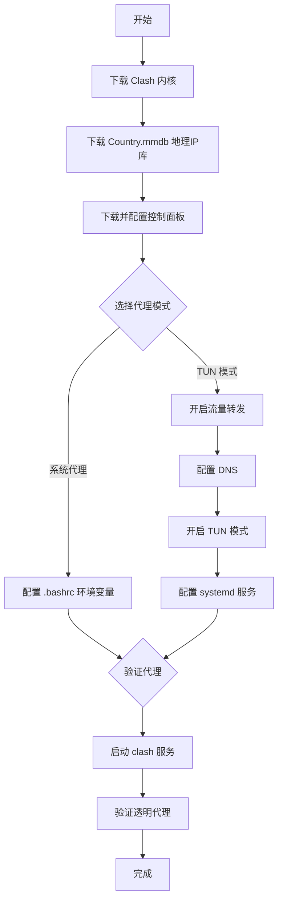

# Linux 安装 Clash 内核并开启透明代理



## 下载 Clash [​](#下载-clash)

### Clash 内核 [​](#clash-内核)

1.  Clash 内核分为 [开源版](https://github.com/Dreamacro/clash/releases) / [Premium 版](https://github.com/Dreamacro/clash/releases/tag/premium)(已删库) / [Meta 版(mihomo)](https://github.com/MetaCubeX/mihomo/releases) ，可以根据需求自行选择版本
2.  在 release 中下载对应系统的内核解压后，重命名为 `clash` 上传至 `/opt/clash`
3.  执行 `chmod +x /opt/clash/clash` 添加运行权限

```sh
mkdir -p /opt/clash && cd /opt/clash && \
wget -O mihomo.gz https://github.com/MetaCubeX/mihomo/releases/latest/download/mihomo-linux-amd64-compatible-v1.19.10.gz && \
gunzip mihomo.gz && chmod +x mihomo
```

### Country.mmdb [​](#country-mmdb)

在 [maxmind-geoip](https://github.com/Dreamacro/maxmind-geoip/releases) 中下载全球 IP 库 Country.mmdb 文件上传至 `/opt/clash`

```sh
wget -O /opt/clash/Country.mmdb https://github.com/Dreamacro/maxmind-geoip/releases/latest/download/Country.mmdb
```

### 控制面板 [​](#控制面板)

在 [metacubexd](https://github.com/MetaCubeX/metacubexd/releases) 中下载面板文件上传至 `/opt/clash/ui`

```sh
mkdir -p /opt/clash/ui && cd /opt/clash/ui && \
wget https://github.com/MetaCubeX/metacubexd/releases/latest/download/compressed-dist.tgz && \
tar -xzf compressed-dist.tgz && rm compressed-dist.tgz
```

### config.yaml [​](#config-yaml)

- 将配置文件命名为 `config.yaml` 上传至 `/opt/clash`

```sh
wget -O /opt/clash/config.yaml https://domain.com/clash.yaml
```

- 在配置文件中，除了常规的节点规则配置以外，确保包含**外部控制**配置

```yaml
external-controller: 0.0.0.0:9090
external-ui: /opt/clash/ui
secret: ""
```

## 启动 Clash [​](#启动-clash)

> [!TIP]
> **推荐启动方式** - 直接运行以下命令即可启动 Clash 服务及前端控制面板：
>
> ```sh
> chmod +x ./mihomo-linux-amd64
> sudo ./mihomo-linux-amd64 -d ./
> ```

启动后，访问 `http://0.0.0.0:9090/ui` 进入登录页面：

- **地址格式**：使用当前主机 IP 地址访问，例如 `http://192.168.10.96:9090`（公网 IP 或局域网 IP 均可）
- **登录密码**：为 `config.yaml` 中 `secret` 字段的值

登录成功后即可进入 Metacube 前端管理系统进行节点选择、规则配置等操作。

## 更新节点配置 [​](#更新节点配置)

当节点过期或失效时，只需替换 `config.yaml` 中的以下三个字段：

- `proxies` - 代理节点列表（单个节点配置）
- `proxy-groups` - 代理组配置（节点分组、轮询策略等）
- `rules` - 规则列表（域名/IP 匹配规则）

```yaml
proxies:
  # 代理节点配置...

proxy-groups:
  # 代理组配置...

rules:
  # 规则配置...
```

> [!TIP]
> 订阅链接通常会提供完整的 `proxies`、`proxy-groups` 和 `rules` 字段，直接替换整个 `config.yaml` 的这三个部分即可。替换后**重启 Clash 服务**使配置生效。

重启方式：

- **前台运行**：停止当前进程后重新执行启动命令
- **systemd**：执行 `systemctl restart clash`

## 系统代理 [​](#系统代理)

1.  创建并编辑 `.bashrc`

2.  将以下代码写入其中

```sh
export http_proxy="http://127.0.0.1:7890"
export https_proxy="http://127.0.0.1:7890"
export all_proxy="socks5://127.0.0.1:7890"
export no_proxy="localhost,127.*,10.*,172.16.*,172.17.*,172.18.*,172.19.*,172.20.*,172.21.*,172.22.*,172.23.*,172.24.*,172.25.*,172.26.*,172.27.*,172.28.*,172.29.*,172.30.*,172.31.*,192.168.*"

source ~/.bashrc
```

## TUN 模式 [​](#tun-模式)

### 开启流量转发 [​](#开启流量转发)

1.  编辑 `/etc/sysctl.conf` 文件

2.  将以下代码取消注释

```txt
net.ipv4.ip_forward=1
net.ipv6.conf.all.forwarding=1
```

3.  加载内核参数

### 开启 dns [​](#开启-dns)

提示

2025 年 3 月之后，海外 DoH / DoT 都被屏蔽了

如需使用，要通过 `https://8.8.8.8/dns-query#proxy` 这样的形式或启用 fake-ip

如不使用 DoH / DoT 则不受影响，正常使用 `8.8.8.8` 这种形式即可

1.  53 端口可能被占用，关闭默认的系统 dns 端口

```sh
systemctl disable systemd-resolved
```

2.  在 Clash 配置文件中添加 dns

```yaml
dns:
  enable: true                          # 是否启用 Clash 内置 DNS 服务器
  ipv6: false                           # 是否解析 IPv6 域名
  enhanced-mode: fake-ip                # DNS 解析模式：fake-ip(返回虚假 IP 地址)
  fake-ip-range: 198.18.0.1/16          # fake-ip 池地址段，避免与真实 IP 冲突
  use-hosts: true                       # 是否使用 /etc/hosts 文件中的解析结果
  respect-rules: true                   # 是否让 DNS 结果遵守路由规则
  listen: 0.0.0.0:53                    # DNS 服务监听地址，Transparent Proxy 需要监听 53 端口
  default-nameserver:                   # 默认 DNS 服务器，用于解析纯 IP 地址
    - 223.5.5.5                         # 阿里云 DNS
    - 119.29.29.29                      # 腾讯 DNS
    - 114.114.114.114                  # 114 DNS
  proxy-server-nameserver:               # 代理 DNS 服务器，通过代理查询的 DNS
    - 223.5.5.5
    - 119.29.29.29
    - 114.114.114.114
  nameserver:                           # 主 DNS 服务器列表
    - 223.5.5.5                         # 国内 DNS，解析国内域名速度快
    - 119.29.29.29
    - 114.114.114.114
  fallback:                             # 备用 DNS 服务器，当 nameserver 解析失败时使用
    - 1.1.1.1                           # Cloudflare DNS
    - 8.8.8.8                           # Google DNS
  fallback-filter:                       # fallback 过滤器
    geoip: true                         # 是否启用 GeoIP 匹配
    geoip-code: CN                      # 默认匹配国家代码：中国
    geosite:                            # 匹配 Geosite 规则
      - gfw                             # 被墙的网站
    ipcidr:                             # 匹配 IP 段
      - 240.0.0.0/4                     # IPv4 组播地址
    domain:                             # 匹配域名列表
      - +.google.com                    # 所有 google.com 子域名
      - +.facebook.com
      - +.youtube.com
```

> **配置说明：**
> - `enhanced-mode: fake-ip` - Clash 返回虚假 IP 地址，实际连接时才通过代理解析真实 IP，有效防止 DNS 污染
> - `fake-ip-range: 198.18.0.1/16` - 专用虚假 IP 段，不会与真实网络地址冲突
> - `nameserver vs fallback` - nameserver 使用国内 DNS 解析国内域名速度快；fallback 使用国外 DNS 解析被墙域名
> - `fallback-filter` - 当 nameserver 返回的 IP 匹配 GeoIP:CN 或 Geosite:gfw 时，切换到 fallback DNS 重新解析，避免国内域名被污染

### 开启 TUN [​](#开启-tun)

> [!NOTE]
> **默认已启用 TUN** - 本项目提供的 `config.yaml` 中已经默认开启了 TUN 模式（`tun.enable: true`），大多数情况下无需手动配置，只需确保 DNS 劫持和路由设置正确即可。

提示

如果将设备作为**旁路网关**，需要将网关和 DNS 都指向该设备，并且关闭**终端设备**的 IPv6（Android 需要 Root）

否则 IPv6 流量可能不会经过指定的 IPv4 网关，更多问题建议参考 [ShellCrash 的常见问题](https://juewuy.github.io/chang-jian-wen-ti/#%E7%BD%91%E7%BB%9C%E7%9B%B8%E5%85%B3%E9%97%AE%E9%A2%98)解决

在 Clash 配置文件中添加 TUN

```yaml
tun:
  enable: true                    # 是否启用 TUN 模式，真正的透明代理
  stack: mixed                   # TUN 堆栈类型：mixed(混合模式，同时支持 TCP/UDP)
  auto-route: true               # 自动设置系统路由，将所有流量导入 TUN 设备
  auto-detect-interface: true    # 自动检测当前活动的网络接口
  device: Mihomo                 # TUN 设备名称，自定义命名便于识别
  mtu: 1500                      # 最大传输单元，数据包最大大小
  dns-hijack:                    # DNS 劫持，将 DNS 请求重定向到 Clash 处理
    - any:53                     # 劫持所有目标的 53 端口 DNS 请求
  route-exclude-address:         # 排除的地址段，不经过代理
    - 192.168.0.0/16             # 局域网地址段
    - 127.0.0.0/8                # 本地回环地址
    - 10.0.0.0/8                 # 私有网络地址段
  strict-route: false            # 严格路由模式，启用可防止 IP 泄漏但可能影响部分应用
```

> **配置说明：**
> - `enable: true` - TUN 模式是实现真正透明代理的关键，不同于系统代理只能处理 HTTP(S) 流量，TUN 可以处理所有 TCP/UDP 流量
> - `stack: mixed` - 推荐使用 mixed 堆栈，兼容性最好
> - `auto-route: true` - 自动接管系统流量，无需手动配置 iptables
> - `dns-hijack` - 将发往任何地址 53 端口的 DNS 请求重定向到 Clash 的 DNS 处理，实现 DNS 劫持
> - `route-exclude-address` - 这些地址不经过代理，避免代理本地局域网流量造成问题
> - `strict-route: false` - 非严格路由模式，对普通用户更友好

## (可选) 使用 systemd 开机自启 [​](#可选-使用-systemd-开机自启)

> [!NOTE]
> 如果你只需要手动启动 Clash 或通过其他方式管理进程，可以跳过此章节。

1.  创建 systemd 配置文件

/etc/systemd/system/clash.service

```ini
[Unit]
Description=Clash 守护进程, Go 语言实现的基于规则的代理.
After=network.target NetworkManager.service systemd-networkd.service iwd.service

[Service]
Type=simple
LimitNPROC=500
LimitNOFILE=1000000
CapabilityBoundingSet=CAP_NET_ADMIN CAP_NET_RAW CAP_NET_BIND_SERVICE CAP_SYS_TIME
AmbientCapabilities=CAP_NET_ADMIN CAP_NET_RAW CAP_NET_BIND_SERVICE CAP_SYS_TIME
Restart=always
ExecStartPre=/usr/bin/sleep 1s
ExecStart=/opt/clash/mihomo -d /opt/clash
ExecReload=/bin/kill -HUP $MAINPID

[Install]
WantedBy=multi-user.target
```

2.  重新加载 systemd

```sh
systemctl daemon-reload
```

3.  接下来就可以通过 systemctl 控制 Clash 启动与停止

```sh
systemctl status clash # 运行状态
systemctl start clash # 启动
systemctl stop clash # 停止
systemctl enable clash # 开机自启
systemctl disable clash # 取消开机自启
```

4.  查看日志可以通过 `journalctl`

```sh
journalctl -u clash --reverse
```
